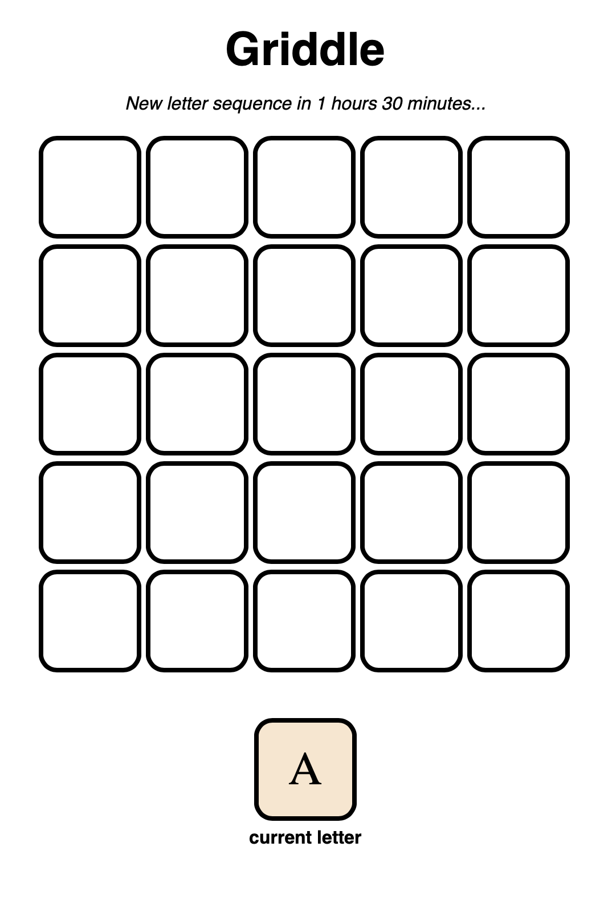

Try it [here](https://griddle.ezaex.com)

## The game

In Griddle, players are presented with a letter tile which they must insert into a 5x5 grid by clicking the appropriate square. On placing a letter, the next is presented, and so on until the grid is complete.  
The sequence of letters is unique to each day and is the same for all players. The sequence changes at midnight UTC, as indicated by the timer.

On the grid's completion, the player is given a score according to the longest word which appears in each row of the grid (left-to-right), and each column (top-to-bottom). The score is simply the sum of the lengths of these longest words, and the longest words themselves are highlighted.

## Development

Development of the concept was quick, but there were several interesting questions to address...
**Coming soon**

[comment]: View the project github [here](https://github.com/EzaEx/griddle)
